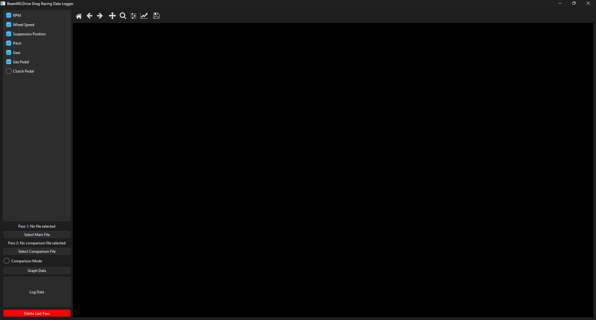
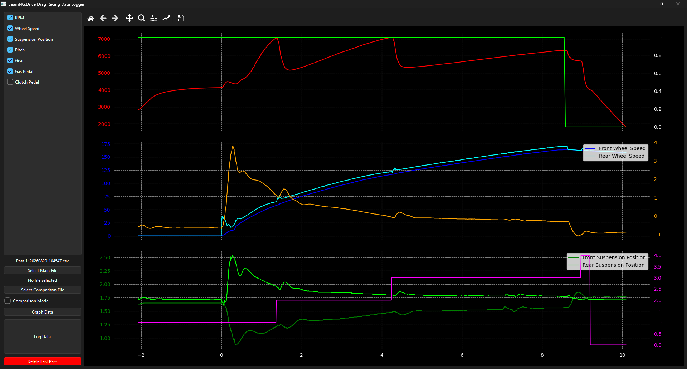
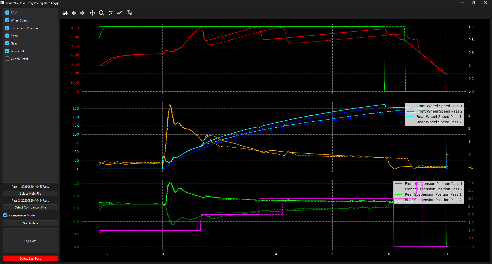

This project is focused on taking the live telementary data from Simhub and BeamNG.Drive, and saving them to look at at a later date. I am making this because I love drag racing in BeamNG.Drive, so I want to have data to look at at a later date to improve my pass.

Initial starting screen with no recorded passes

One pass being shown. This is also the starting state when there are recorded passes. The most recent pass is loaded into the graph

Two passes being shown in comparison to each other. The passes are lined up on when the vehicle starts moving.

