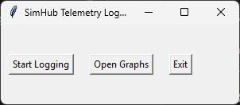
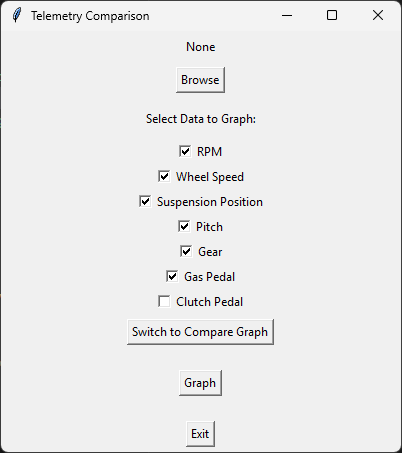
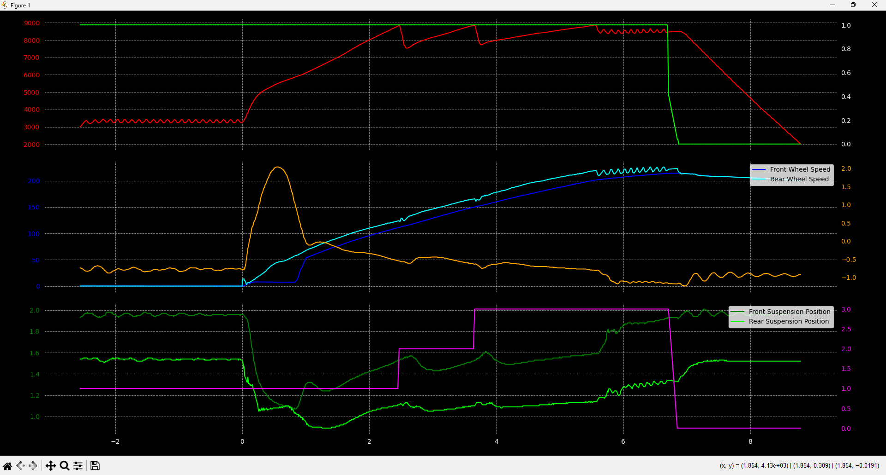
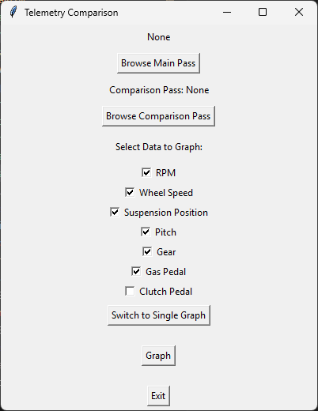
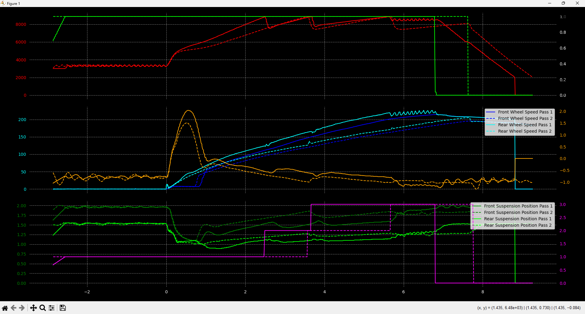

This project is focused on taking the live telementary data from Simhub and BeamNG.Drive, and saving them to look at at a later date. I am making this because I love drag racing in BeamNG.Drive, so I want to have data to look at at a later date to improve my pass.

Main Menu

Individual pass selection and graph screens

Pass comparison selection and graph screens

